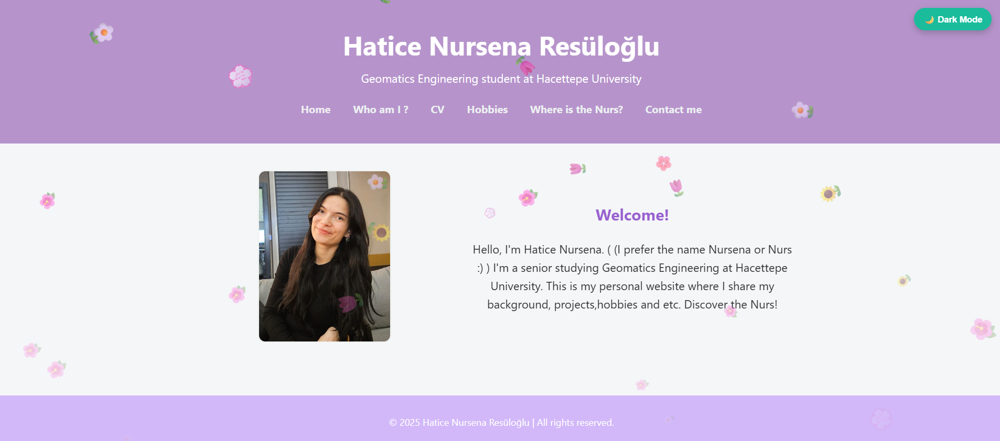
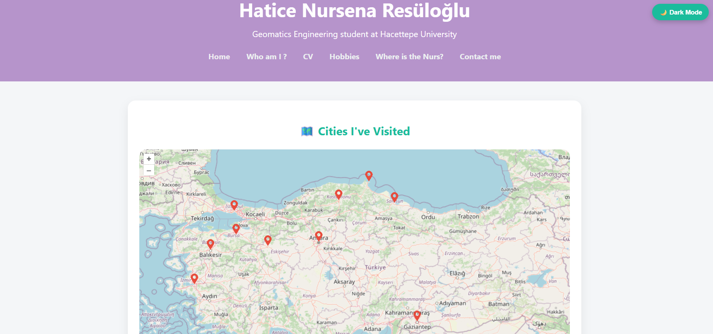
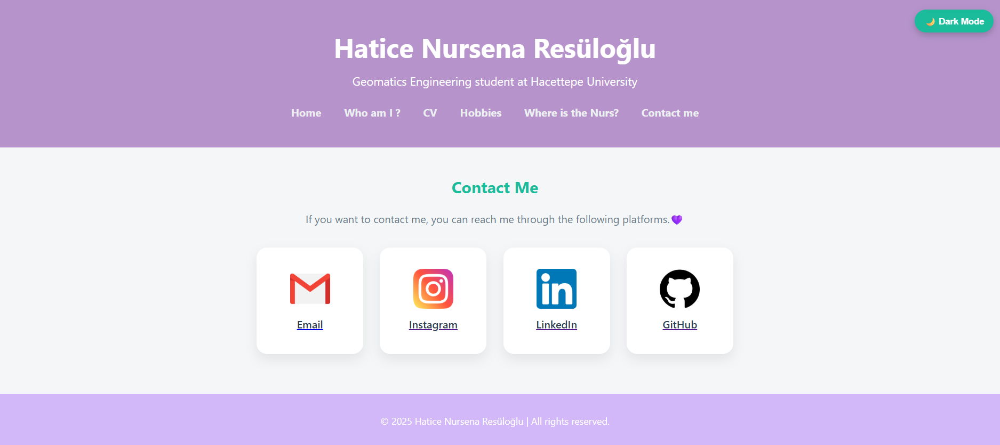

# 🌸 Hatice Nursena Resüloğlu – Personal Website
🔗 [ https://gmt-458-web-gis.github.io/personal-web-page-nursenar-1/]( https://gmt-458-web-gis.github.io/personal-web-page-nursenar-1/)

This project is a **personal portfolio website** built using **HTML, CSS, and JavaScript**.  
It was created to introduce myself, showcase my projects and interests, and demonstrate my web development skills.

---

## 🖥️ General Information

📍 **Project Name:** Personal Portfolio Website  
👩‍💻 **Author:** Hatice Nursena Resüloğlu  
🎓 **Department:** Geomatics Engineering, Hacettepe University  
🌐 **Technologies Used:**  
- HTML5  
- CSS3 (responsive layout, animations, card design)  
- JavaScript (interactive features, dark mode, effects)  
- OpenLayers (interactive map integration)

---

## 📂 Website Structure

| Page | Description |
|------|--------------|
| **index.html** | Home page — name, title, short introduction, and falling flower animation 🌸 |
| **about.html** | About Me — photos, favorite movies, series, books, and bands with a gallery layout 📷 |
| **cv.html** | Resume — education, experiences, skills, and a downloadable PDF version 📄 |
| **map.html** | Interactive map (OpenLayers) showing 10 cities I’ve visited with pins and photos 🗺️ |
| **hobbies.html**  | Hobbies and personal interests displayed as image cards 🧶 |
| **contact.html** | Contact page with clickable icons for mail, Instagram, LinkedIn, and GitHub 💌 |

---

## 💜 JavaScript Features Implemented

| Feature | Description |
|----------|--------------|
| 🌸 **Falling Flowers Animation** | Flowers gently fall from the top when the home page loads |
| 🔝 **Scroll-to-Top Button** | A glowing, sparkling button that scrolls smoothly to the top |
| 🌙 **Dark/Light Mode Toggle** | A switch in the top-right corner to toggle between themes (saved in localStorage) |
| 🗺️ **Interactive Map (OpenLayers)** | Shows 10 pinned cities — clicking a pin displays related photos below |
| 💫 **Hover Animations** | Cards and logos enlarge or rotate slightly when hovered |
| 💌 **Contact Page Animations** | Social media logos light up with rotation and color effects on hover |

---

## 🗺️ Cities Pinned on the Map

- Kastamonu  
- Ankara  
- İstanbul  
- Eskişehir  
- Gaziantep  
- Sinop  
- Bursa  
- İzmir  
- Balıkesir  
- Samsun  

Each pin displays city photos in a gallery below the map when clicked.

---

## 🎨 Screenshots

### 🏠 Home Page

### 👩‍💼 About Me Page

### 📄 CV / Resume Page

### 🗺️ Map Page

### 💌 Contact Page

---

## 🧠 What I Learned
- Structuring semantic HTML pages  
- Designing responsive layouts with CSS  
- Using OpenLayers for interactive map visualization  
- Manipulating the DOM with JavaScript  
- Creating animations, themes, and storing preferences in localStorage  
- Publishing static websites on GitHub Pages  

---

## 🚀 Live Demo

🔗 [ https://gmt-458-web-gis.github.io/personal-web-page-nursenar-1/]( https://gmt-458-web-gis.github.io/personal-web-page-nursenar-1/)

---

## 📬 Contact
- **Email:** hnresl07@gmail.com  
- **Instagram:** [instagram.com/hatice.nursena](https://www.instagram.com/hatice.nursena/)  
- **LinkedIn:** [linkedin.com/in/haticenursenaresuloglu](https://www.linkedin.com/in/haticenursenaresuloglu/)  
- **GitHub:** [github.com/haticenursena](https://github.com/haticenursena)

---

### 🌷 Acknowledgments
This portfolio project was created to reflect my personal and academic growth in web design and geospatial studies.  
Feel free to fork or contribute via pull requests 💜

